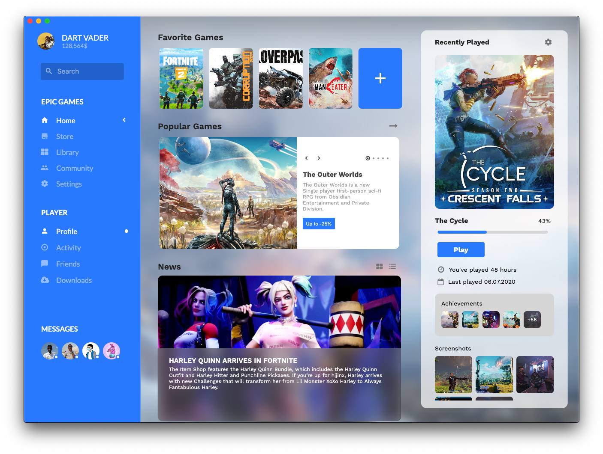

# Epic Games Flutter UI

A flutter implementation of the Epic Games Concept Home Page by [Andrey Artamonov](https://dribbble.com/aai210).

A screenshot:

## Getting Started 🚀

- You need the [Flutter SDK](https://flutter.dev/docs/get-started/install) setup.
- [You should setup your desktop environment to be able to run the code on desktop](https://flutter.dev/desktop).
- Get packages with `$ flutter packages get`.
- Run it `$ flutter run -d macos`, replace _macos_ with your platform.